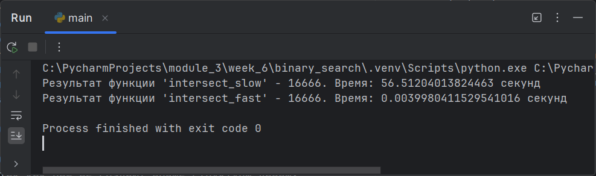

### Ускорение алгоритма

На примере функции, которая принимает два списка,
в каждом из которых элементы не повторяются.
Функция должна возвращать количество элементов,
которые встречаются в обоих списках.

Временная сложность:

* `intersect_slow` - временная сложность для функции составляет `O(N^2)`,
  связано с тем, что функция выполняет вложенные циклы по элементам
  обоих списков.
* `intersect_fast` - временную сложность `O(n)`, так как функция использует
  набор `(set)` для хранения элементов второго списка и
  проверяет принадлежность элемента к этому набору за константное время,
  а не за линейное, как при использовании списка.

Сложность по памяти:

Обе функции используют O(1) дополнительной памяти,
так как они не создают новые структуры данных,
а только изменяют значения переменных.
Однако функция `intersect_fast` использует дополнительную память
для создания набора `(set)`, но эта память освобождается
после выполнения функции.

